MERN Stack Authentication & CRUD with MySQL

Project Description

This is a full-stack MERN application built using React.js, Node.js, Express.js, and MySQL.

The project includes:
	•	User Registration
	•	Login Authentication
	•	Forgot Password
	•	Reset Password
	•	JWT Token Authentication
	•	Protected Dashboard
	•	Full CRUD Operations
	•	Statistics Cards
	•	Search and Filter
	•	Pagination
	•	Dark Mode Toggle
	•	Export Items to CSV
	•	Profile Update Page

This project was developed as part of the CampusPe Full Stack Development Assignment.

Tech Stack
Frontend
	•	React.js
	•	React Router DOM
	•	Axios
	•	CSS

Backend
	•	Node.js
	•	Express.js
	•	MySQL
	•	mysql2
	•	bcryptjs
	•	jsonwebtoken
	•	dotenv
	•	cors

 Database

Database Name:mern_auth_db

Tables:
	•	users
	•	items

Backend Setup
cd backend
npm install
npm run dev
Runs on :
http://localhost:5000

Authentication Routes

POST /api/auth/register
POST /api/auth/login
POST /api/auth/forgot-password
POST /api/auth/reset-password
GET  /api/auth/me
PUT  /api/auth/profile

DASBOARD ROUTES
GET    /api/items
POST   /api/items
PUT    /api/items/:id
DELETE /api/items/:id
GET    /api/items/stats/all

Features Implemented

Authentication
	•	User Registration
	•	Login
	•	Forgot Password
	•	Reset Password
	•	JWT Authentication
	•	Protected Routes

Dashboard
	•	Add New Items
	•	Edit Items
	•	Delete Items
	•	Statistics Cards
	•	Search and Filter
	•	Pagination
	•	Dark Mode
	•	Export CSV
	•	Profile Update

SCREENSHOTS

LOGIN PAGE
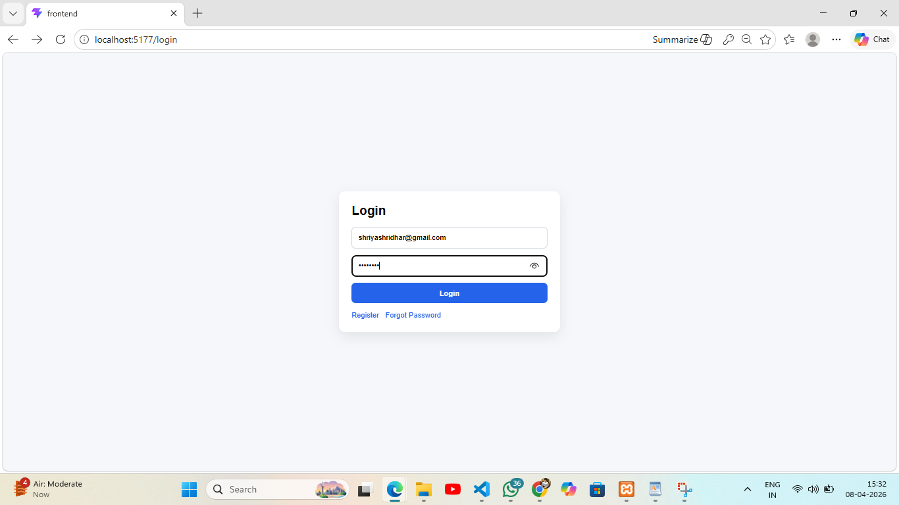
REGISTER PAGE
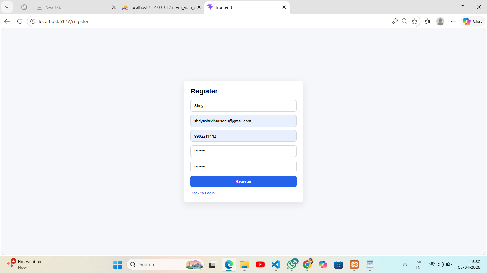
FORGOT PASSWORD
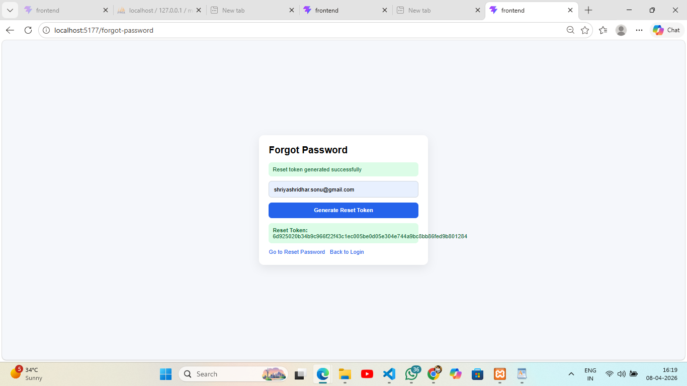
RESET PASSWORD
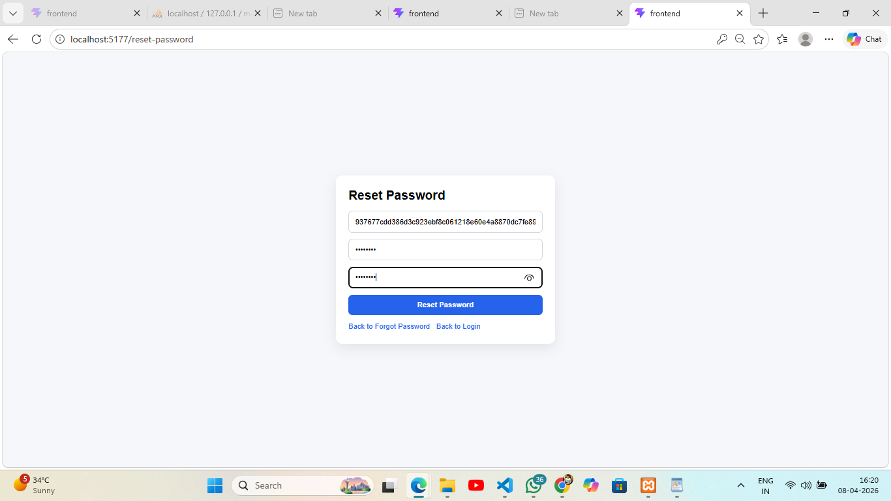
DASHBOARD PAGE 
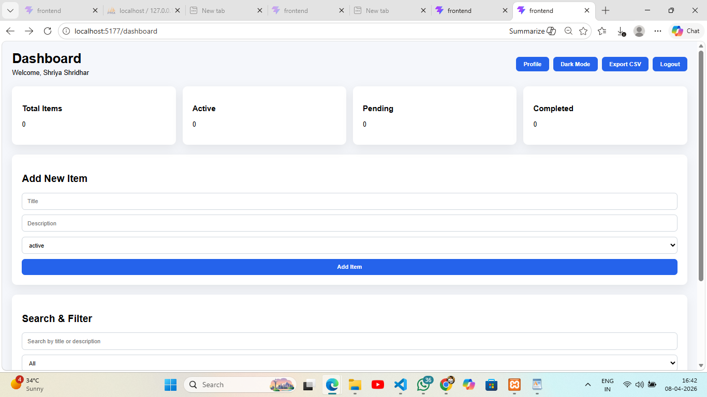
CRUD OPERATIONS
ITEM CREATE
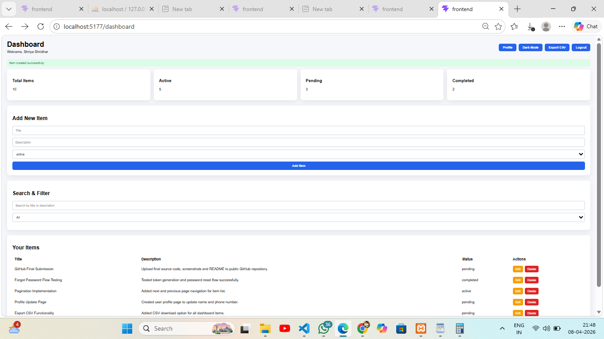
EDIT ITEM
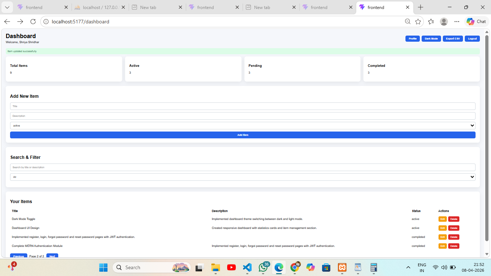
ITEM DELETE

BONUS FEATURES
EXPORT CSV
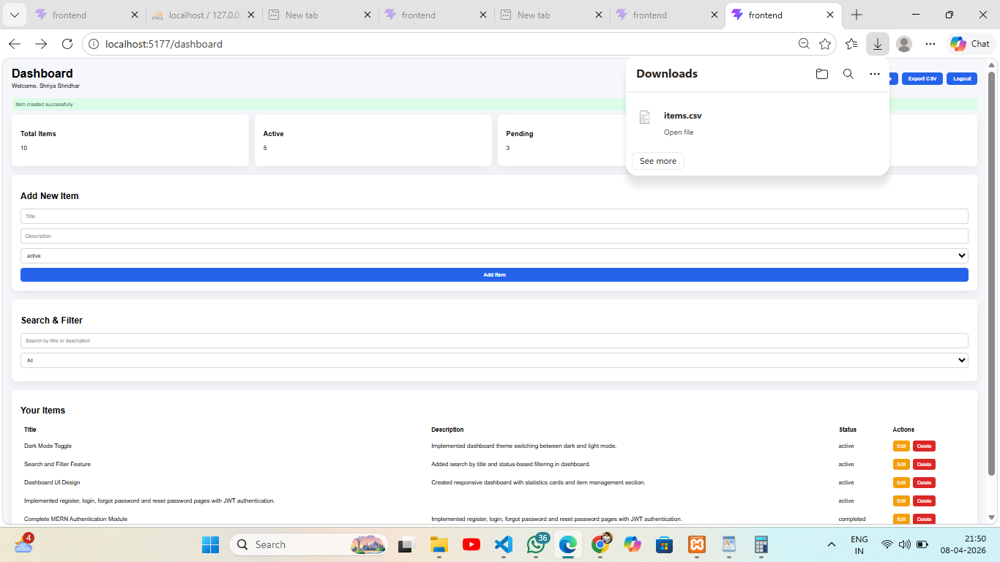
PAGINATION
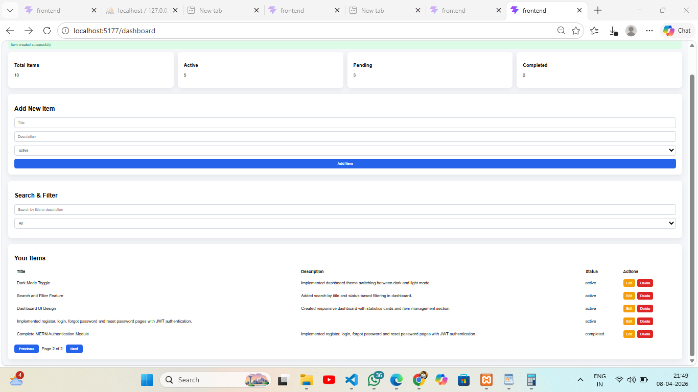

MYSQL DATABASE
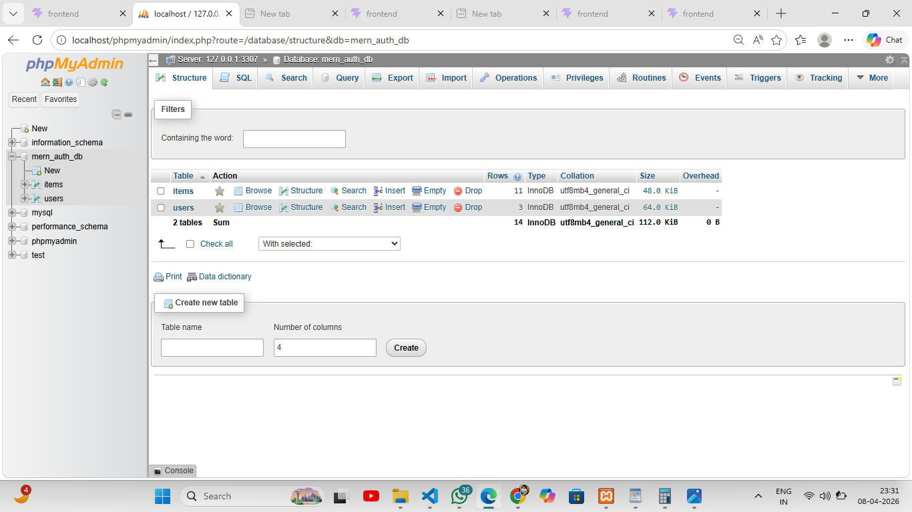
MYSQL ITEMS
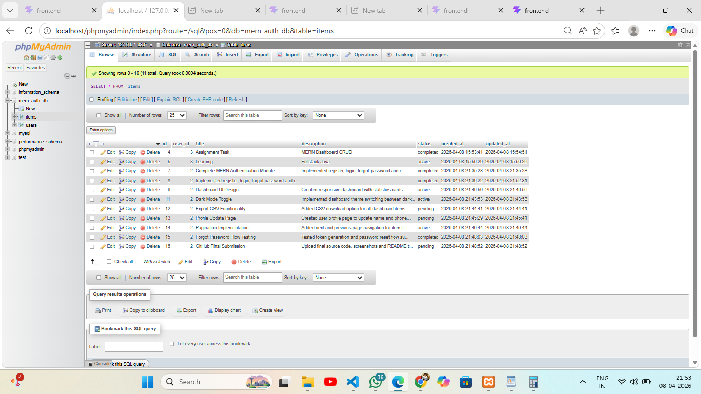
MYSQL USERS
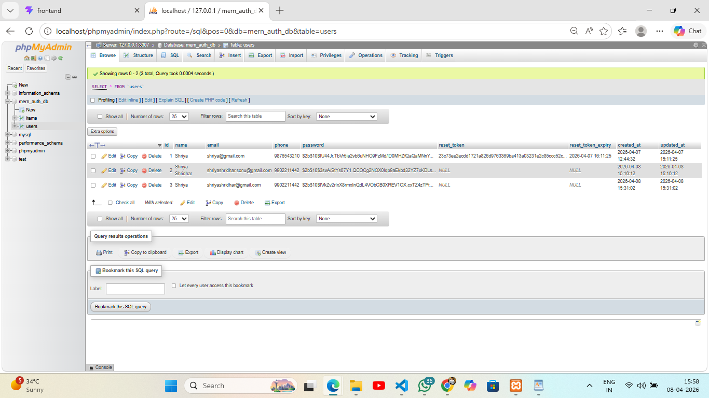

FOLDER STRUCTURE
mern-project
│
├── backend
│   ├── config
│   ├── controllers
│   ├── middleware
│   ├── routes
│   └── server.js
│
├── frontend
│   ├── src
│   └── public
│
├── screenshots
├── database.sql
└── README.md

Developed by 
Shriya Shridhar
